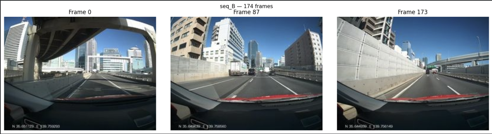
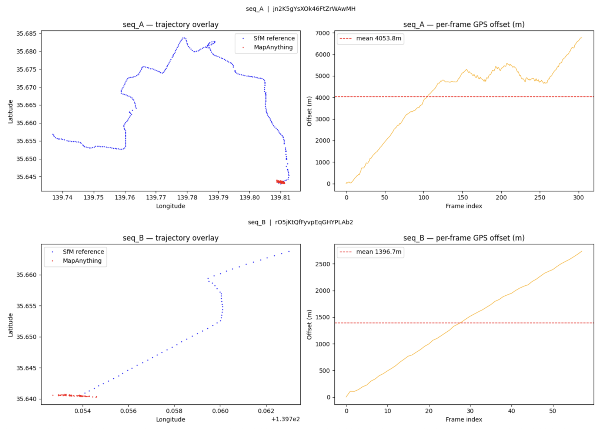
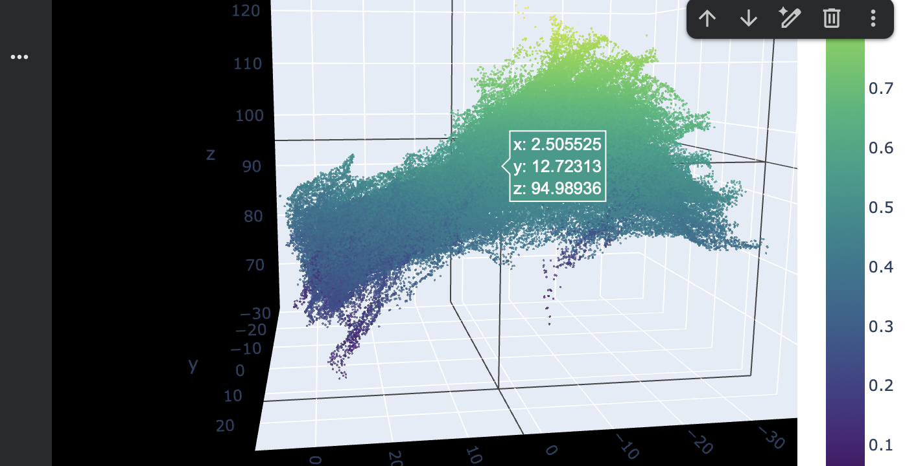
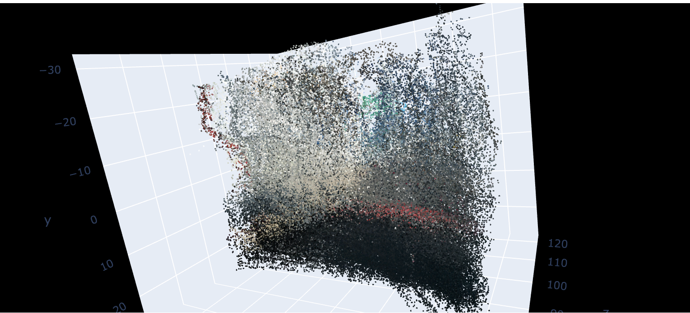

# Mapillary × MapAnything x Vggt-Long x Pi-Long — Street-Level 3D Reconstruction Pipeline

A research pipeline for metric 3D reconstruction, trajectory evaluation, and Gaussian Splatting from Mapillary street-level imagery, built on Meta's [MapAnything](https://github.com/facebookresearch/map-anything) feed-forward transformer.

> Study area: two street-level driving sequences through **Tokyo, Japan** — ~870 raw Mapillary frames each, sampled at stride 5 down to ~174 inference frames per sequence.

---

## Pipeline Overview

```
Mapillary API  ──►  MapAnything Inference  ──►  Point Cloud / Splat / COLMAP
  (GPS poses)        (metric 3D, no SfM)          (visualization + 3DGS)
```

The pipeline has two branches:

| Branch | Notebooks | Runs on |
|---|---|---|
| **Trajectory evaluation** | `mapanything-pipeline`, `mapanything-pipeline-v2` | Local / Jupyter |
| **3D reconstruction + Gaussian Splatting** | `mapanything_pipeline-splatv1`, `mapanything_pipeline-splatv2` | Google Colab A100 |

> Notebooks are not included in this repo due to size. See [Notebooks](#notebooks) for descriptions and access.

---

## Outputs

### Sequence Image Preview
*~174 street-level frames from a Tokyo driving sequence, fetched from the Mapillary API at stride 5.*



---

### Mapillary GPS Trajectory
*Raw GPS track from `computed_geometry` overlaid on the route. Used as ground truth for ATE/RPE.*



---

### Plotly 3D Point Cloud
*Dense colored point cloud reconstructed by MapAnything. 30k-point subsample, 3σ outlier clip, colored by `img_no_norm` pixel values.*



---

### Gaussian Splat — Naive (splatv1)
*First splat export: fixed scale=0.05, opacity=200, no confidence filtering. ~200k Gaussians, ~6 MB.*


---

### Gaussian Splat — Improved (splatv2)
*Improved export: kNN-adaptive scale, confidence-weighted opacity [120–255], 4M Gaussians subsampled consistently. ~128 MB. Viewed in [antimatter15.com/splat](https://antimatter15.com/splat/).*



---

## Architecture

```
Mapillary API
    │  image IDs + GPS poses (geometry / computed_geometry)
    │  stride=5 download → ~174 JPEGs cached to Drive
    ▼
MapAnything  (facebook/map-anything-apache)
    │  feed-forward transformer — no per-scene optimization, no COLMAP
    │  3-split inference (~60 frames/split, 5-frame overlap)
    │  memory_efficient_inference=False — full attention per split
    │
    │  Per-frame outputs used:
    │    pts3d          (H×W×3)  3D points, world coords
    │    img_no_norm    (H×W×3)  preprocessed image, pixel-aligned with pts3d
    │    conf           (H×W)    per-pixel confidence
    │    mask           (H×W×1)  validity mask
    │    camera_poses   (4×4)    cam-to-world transform
    │    intrinsics     (3×3)    recovered pinhole K
    ▼
extract_reconstruction()
    │  confidence-masked pts + colors + normalized conf per frame
    │  returns: (pts, cols, confs, cam_poses, cam_K)
    ▼
    ├── Plotly 3D scatter      30k subsample, 3σ clip, dark theme
    ├── Colored PLY            Open3D visualization
    ├── Improved .splat        4M Gaussians → antimatter15.com/splat
    └── COLMAP export          cameras.txt / images.txt / points3D.txt
                               → gaussian-splatting trainer
```

---

## Trajectory Metrics

Haversine-derived metrics comparing GPS ground truth against MapAnything-recovered poses across each sequence.

| Metric | Description |
|---|---|
| **ATE** (Absolute Trajectory Error) | Mean positional deviation over the full sequence |
| **RPE** (Relative Pose Error) | Mean frame-to-frame delta error |
| **Total distance** | Haversine sum over GPS waypoints |

---

## Splat Comparison

| | Naive (splatv1) | Improved (splatv2) |
|---|---|---|
| **Inference stride** | 2 (every other frame) | 1 (all ~174 frames) |
| **Inference mode** | Single call, `minibatch=12` | 3-split, `minibatch=6` |
| **Scale** | Fixed `0.05` | kNN mean distance to 4 neighbors |
| **Opacity** | Fixed `200` | `conf → [120, 255]` |
| **Gaussians** | ~200k | 4M (subsampled from ~32.5M) |
| **File size** | ~6 MB | ~128 MB |

---

## COLMAP Export

Output structure for downstream 3DGS training:

```
seq_B_colmap/
├── images/              # ~174 JPEGs renamed 00001.jpg … 000174.jpg
└── sparse/0/
    ├── cameras.txt      # 1 PINHOLE camera, model-recovered fx fy cx cy
    ├── images.txt       # QW QX QY QZ TX TY TZ per frame (scipy Rotation)
    └── points3D.txt     # intentionally empty
```

Train with:
```bash
git clone https://github.com/graphdeco-inria/gaussian-splatting
pip install -r requirements.txt
python train.py -s /path/to/seq_B_colmap --iterations 7000
```

---

## Key Implementation Notes

**Stride math**
The `stride` parameter in `SEGMENT_IDS[::stride]` applies to the ~174 *already-downloaded* IDs, not the 870 raw API frames. Stride=1 in the splat notebooks uses all available cached images.

**OOM on A100 (80 GB)**
MapAnything with `memory_efficient_inference=False` runs full O(N²) attention — 174 frames at once exceeds VRAM. The 3-split approach (~60 frames per split with 5-frame overlap) keeps each chunk within budget.

**NumPy 2.0 compatibility**
`ndarray.ptp()` was removed in NumPy 2.0. All uses replaced with `.max() - .min() + 1e-8`.

**Array consistency**
`pts`, `cols`, and `confs` must be subsampled with the same index array `idx` before export. Subsampling any one array separately causes shape mismatch errors inside `export_improved_splat`.

**Browser Gaussian limit**
3–5M Gaussians (~96–160 MB) is the practical limit for `antimatter15.com/splat`. The unsubsampled 32.5M export (992 MB) causes a `TypeError: Load Failed` in browser.

---

## Notebooks

Notebooks are maintained separately and shared on request. Four notebooks in total:

| Notebook | Purpose |
|---|---|
| `mapanything-pipeline` | Base pipeline — API fetch, haversine metrics, MapAnything inference, Plotly 3D |
| `mapanything-pipeline-v2` | Adds Section 9: colored PLY builder, COLMAP export |
| `mapanything_pipeline-splatv1` | First Colab splat run (naive export, stride=2) |
| `mapanything_pipeline-splatv2` | Capstone — all fixes, improved splat, cloudflared viewer, COLMAP |

---

## Setup

### Local (pipeline notebooks)
```bash
pip install requests pandas numpy plotly open3d scipy geopy
```
A Mapillary API token is required — set `MLY_TOKEN` in the notebook config cell.

### Google Colab A100 (splat notebooks)
```python
pip install "mapanything[all] @ git+https://github.com/facebookresearch/map-anything.git@main"

from google.colab import drive
drive.mount('/content/drive')
```

Sequence images are expected at:
```
MyDrive/Mapillary_HERE_Init_Sequences/
├── seq_A_<id>/    # ~174 JPEGs
└── seq_B_<id>/    # ~174 JPEGs
```

---

## Roadmap

- [ ] Swap percentile confidence threshold for `non_ambiguous_mask` (cleaner sky/reflection removal)
- [ ] Apply `metric_scaling_factor` per split to remove inter-split seam offsets
- [ ] Feed COLMAP output into full 3DGS trainer (Kerbl et al. 2023)
- [ ] MLflow experiment tracking for model comparison (MapAnything vs VGGT)

---

## References

- [MapAnything — Meta Research](https://github.com/facebookresearch/map-anything)
- [Mapillary API v4](https://www.mapillary.com/developer/api-documentation)
- [3D Gaussian Splatting (Kerbl et al.)](https://github.com/graphdeco-inria/gaussian-splatting)
- [antimatter15 splat viewer](https://antimatter15.com/splat/)
- [cloudflared tunnels](https://github.com/cloudflare/cloudflared)

---

## License

Research use. MapAnything model weights are released under the Apache 2.0 license by Meta. Mapillary imagery is subject to [Mapillary Terms of Service](https://www.mapillary.com/terms).
